# Github Actions

## Què és CI/CD?

• Continuous Integration (CI):
Consisteix en integrar codi freqüentment en un repositori compartit. Cada integració passa proves automatitzades per detectar errors aviat i corregir-los ràpidament.

• Continuous Delivery (CD):
Va més enllà del CI assegurant que el codi sempre està llest per ser desplegat. Això inclou proves i validacions automatitzades que faciliten l’alliberament de noves versions amb confiança.

• Continuous Deployment (CD):
Porta el lliurament continu a un altre nivell: cada canvi aprovat es desplega automàticament a producció. Això requereix processos de prova robustos per evitar problemes.

## Github Actions

És la solució de Github per implementar CI/CD d’una manera senzilla i integrada. Permet automatitzar tasques com provar, construir i desplegar codi amb només configurar un fitxer YAML.

Components principals:

- Workflow: Seqüència automatitzada de passos que s’activa per esdeveniments (push, PR, etc.).
- Jobs: Agrupen passos individuals que s’executen en un mateix entorn (runner). Els jobs poden ser paral·lels o seqüencials.
- Steps: Cada tasca dins d’un job, com executar comandes o utilitzar accions predefinides.
- Actions: Blocs reutilitzables de funcionalitat que s’integren en els steps.
- Runner: El servidor (hosted o self-hosted) on s’executen els jobs.

## Runners: Què són i tipus

Son servidors que executen els passos d’un flux de treball. És com l’encarregat de dur a terme les tasques definides en el teu fitxer YAML de workflows (per exemple, construir, provar o desplegar una aplicació).

• Github-hosted runners:
Estan al núvol, sense necessitat de configuració ni manteniment. Disposen de sistemes operatius com Windows, MacOS i Ubuntu. Es paga pel temps d’ús (2000 minuts gratuïts al mes).

• Self-hosted runners:
Configurats en màquines pròpies, ofereixen més flexibilitat i control sobre els recursos. No tenen cost d’ús, però requereixen manteniment i configuració.

## Com crear un workflow

Els workflows es defineixen en fitxers YAML ubicats al directori .github/workflows del repositori.

```yaml
name: Exemple bàsic
on: [push]
jobs:
  prova:
    runs-on: ubuntu-latest
    steps:
      - uses: actions/checkout@v2
      - run: echo "Hola, món!"
```

- name: Nom opcional del workflow.
- on: Esdeveniments que activen el workflow (push, PR, etc.).
- jobs: Agrupació de tasques que defineixen el flux de treball.
- steps: Comandes o accions a executar dins del job.

### Elements avançats en workflows

- needs: Per especificar dependències entre jobs i assegurar execució seqüencial.
- runs-on: Defineix el sistema operatiu del runner.
- env: Variables d’entorn per personalitzar els jobs.
- strategy: Permet executar variacions d’un mateix job (per exemple, amb diferents versions de Node.js).

```yaml
jobs:
  build:
    runs-on: ubuntu-latest
    strategy:
      matrix:
      node: [14, 16]
    steps:
      - uses: actions/setup-node@v2
        with:
          node-version: ${{ matrix.node }}
      - run: npm install && npm test
```

## Custom GitHub Actions

Són tasques individuals que pots combinar per crear feines i personalitzar el teu flux de treball. S'executen dins d'un **step**, que forma part d'un **job**, que compon un **workflow**.

Hi ha dos tipus principals:

- Docker-container actions: Funcionen en entorns Linux. Són més lentes però consistents.
- Javascript actions: Més ràpides i lleugeres, però han de ser compatibles amb tots els runners si s’utilitzen fora de Linux.

### Sintaxi

- Les Actions requereixen un fitxer de metadades en format YAML (`.yml` o `.yaml`).
- Les dades principals d'aquest fitxer són:
  - **name** (nom): Obligatori.
  - **autor**: Opcional.
  - **description**: Obligatori. Descripció breu de l'Action.
  - **inputs** (entrades): Opcional. Defineix paràmetres d'entrada.
  - **outputs** (eixides): Opcional. Defineix les dades generades per l'Action.
  - **runs**: Obligatori. Defineix com s'executa l'Action.
    - Versió Javascript: Apunta al codi principal.
    - Versió Docker: Defineix la imatge o Dockerfile utilitzat.
  - **branding**: Opcional. Defineix color e icono per al marketplace.

```yaml
name: Salutació
description: Acció per saludar
inputs:
  nom:
    description: Nom de la persona a saludar
    required: true
outputs:
  missatge:
    description: Missatge complet
runs:
  using: "node12"
  main: "index.js"
```

## Exemple GitHub Action en Javascript

1. Crear fitxer `action.yml`:
   - Ubicació: `.github/actions/hello-world-javascript-action/action.yml`.
2. Crear projecte Node:
   - `npm init -y`.
   - Instal·lar dependències:
     ```bash
     npm install @actions/core
     npm install @actions/github
     ```
3. Crear `index.js` amb la lògica principal.
4. Compilar el projecte:
   - Instal·lar la llibreria per compilar:
     ```bash
     npm i -g @vercel/ncc
     ```
   - Compilar l'arxiu principal:
     ```bash
     ncc build index.js
     ```
   - Actualitzar `action.yml`:
     ```yaml
     main: "dist/index.js"
     ```
5. Provar l'Action dins d'un workflow.

---

## Exemple GitHub Action en Docker

1. Crear un `Dockerfile` amb la configuració necessària.
2. Crear el fitxer `action.yml` que defineix com s'executarà l'Action.
3. Provar l'Action dins d'un workflow.

---

---

---

# Pràctica

Primer que res, creem un repositori propi i clonem el repo que ens dona l’ enunciat.


Instalem els moduls de node amb npm i (install)


Comprovem que el projecte s' inicia correctament

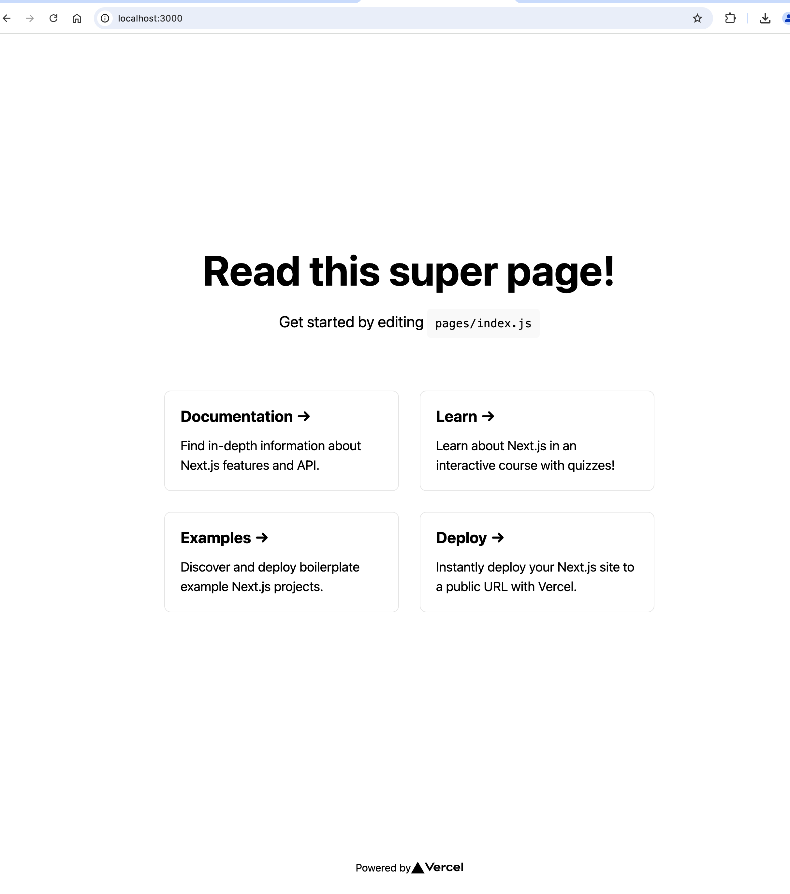

### Linter-job

Executem npm run lint en local perque comprove la sintaxi


Corregim tots els errors i executem npm lint

FALTA CAPTURA DELS ERRORS I LA SEUA CORRECCIO


Creem la carpeta .github i dins de /workflows creem l'arxiu pipeline.yml amb:

- Nom: main
- Que s'execute cada vegada que fem un push al repositori

I definim un nou job que correspon a EsLint i que conte:

- S'executa amb l' ultima versió d'Ubuntu
- Primer pas
  - Executa l'action Checkout, per accedir als arxius del projecte
- Segon pas
  - Executa l'action setup-node per instalar i configurar node en el job amb la versio 20.
- Tercer pas, instalar dependencies
- Quart pas
  - Executa npm run lint per executar eslint en el codi del projecte

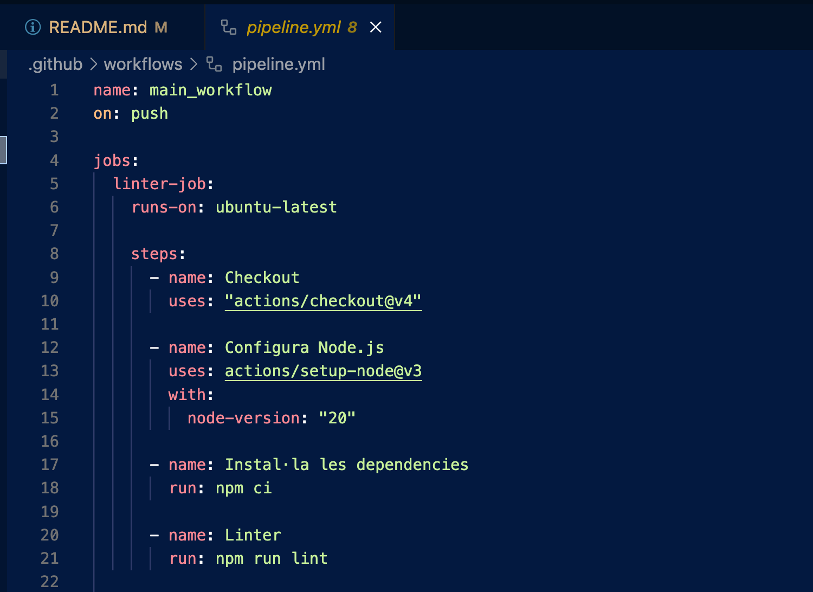

Fem el commit i comprovem que passe el job de linter
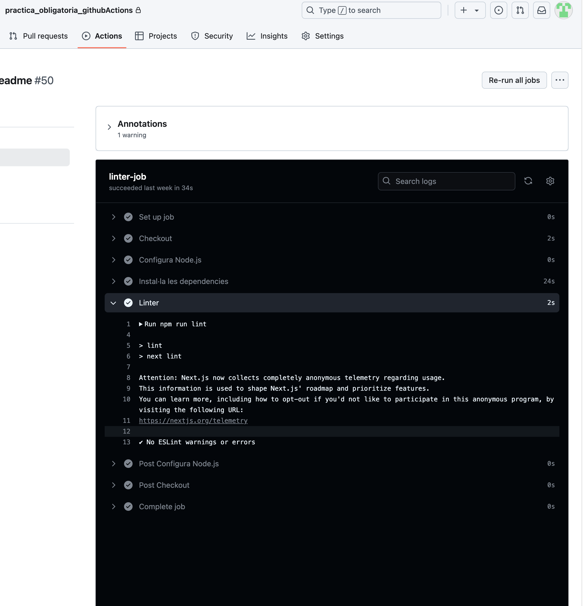

### Cypress-job

Primerament, executem i comprovem que els test no passen en local.
Seguidament, amb els resultats corregim els errors que hi havia en el codi
FALTA CAPTURA DE TOTS ELS ERRORS I LA SEUA CORRECCIO


Tornem a executar en local cypress per comprovar que els tests s'executen correctament


Dins de /workflows creem l' action que correspon a Cypress

- S'executa amb l' ultima versió d'Ubuntu
- Precisa del lint-job per a poder executar-se
- Primer pas
  - Executa l'action Checkout, per accedir als arxius del projecte
- Segon pas
  - Executa l'action setup-node per instalar i configurar node en el job amb la versio 20.
- Tercer pas
  - Amb l'action cypress-io, executem els tests (npm run dev):
    - En chrome
    - Te que esperar a que localhost:3000 estiga actiu abans de començar
    - Publica els resultats
    - Continua encara que fallen
- Quart pas
  - Guarda el resultat dels tests (success o failure) en un arxiu dins de la carpeta artifacts
- Quint pas  
  -Agafant l' arxiu generat en el pas anterior el puja amb un artifact i l'exposa a l'exterior amb l' accio corresponent (upload-artifact)

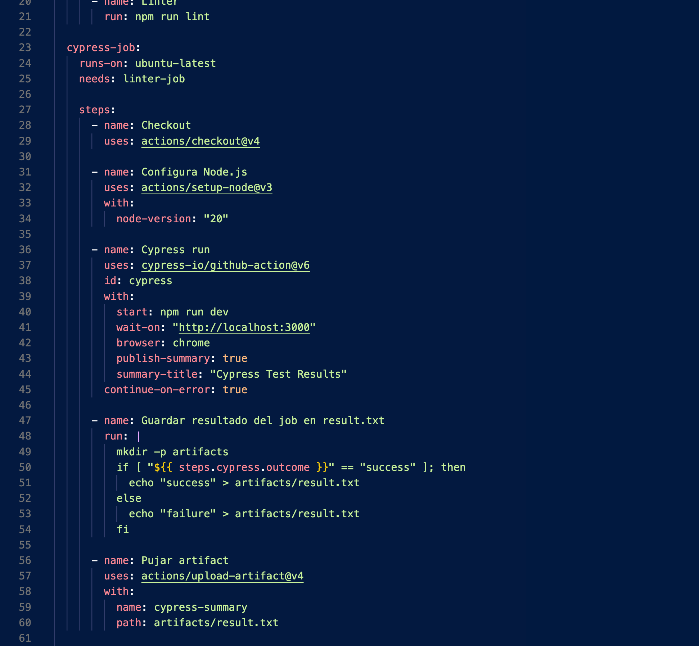

Fem el commit i comprovem que haja passat tots els jobs i que haja generat correctament l' artifact
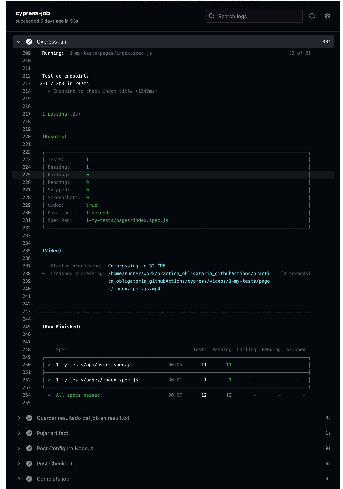
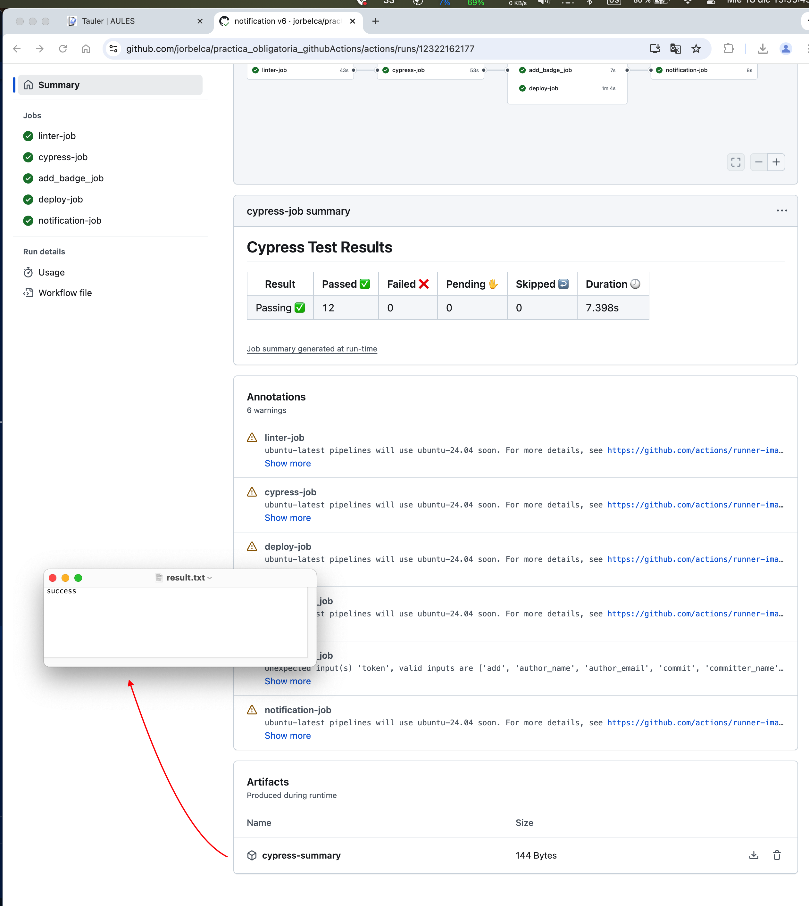

### Badge-job

Primer, creem un nou directori dins de .github/workflow (actions/update-badge) , e iniciem un nou projecte de node amb _npm init -y_


Seguidament, creem el arxiu action.yml que consisteix en una accio personalitzada que te com a input obligatori el resultat del test que hem executat anteriorment amb cypress. Executa l'arxiu que compilarem i que conte la funcionalitat , en node versió 20


Creem l'arxiu index.js a l' arrel del projecte que será el que conté tota la lógica que duga a terme l'acció. Es una funció en javascript que te com a únic argument testResult i que dependent de el seu valor asigna una imatge diferent a la variable badge.
LLig el contingut de readme.
E inserta el valor de badge dins d'uns comentaris especifics i finalitza actualizant l' arxiu README.md .


Tot seguit, instalem les dependencies (actions/core , actions/github i vercel/ncc ) per a que el script funcione degudament i pugam compilar-lo.
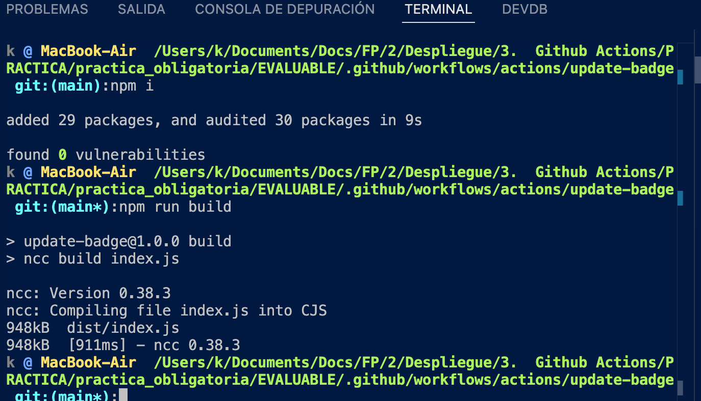

Captura del package.json de l'acció


Passem al pipeline i definim un nou job que conte:

- S'executa amb l' ultima versió d'Ubuntu
- Precisa de l'accio anterior per poder executar-se
- Primer pas
  - Checkout, per accedir als arxius del projecte
- Segon pas
  - Descarrega el artifact de l'acció anterior, des del mateix path
- Tercer pas
  - Crea i asigna a una variable el contingut del artifact
- Quart pas
  - Crida a la action personalitzada que acavem de crear amb la variable creada en el pas anterior
- Quint pas
  - Finalment, per modificar el Readme fem ús de la action endbug-add-and-commit que fara us d'un token amb permisos d' escriptura


Per poder modificar el readme, necessitem d' un token amb permisos d'esciptura en el repo. El creem i el vinculem a una variable d' entorn


Pugem els canvis i comprovem que s'executen les dos actions associades.


**FALLO**

Per tal de comprovar que el badge de fallo s'executa degudament, insertem un test que falle.


Fem el commit, pugem els canvis i esperem a que s'executen els works corresponents i comprovem els logs:


Badge actualizat:


### Deploy-job

Primer que res hem de vincular el nostre projecte amb Vercel, per aixo executem en consola vercel y configurem el projecte seguint les preguntes


Generem un token desde Vercel i junt amb els tokens que ha generat la vinculacio del projecte, els almacenem com a secrets per a les actions


Creem el deploy-job que consistirá en un job amb:

- S'executa amb l' ultima versió d'Ubuntu
- Precisa del cypress-job per executa-se
- Primer pas
  - Checkout, per accedir als arxius del projecte
- Segon pas
  - Deploy amb l'acció específica de Vercel, amb els tokens generats i establint el directory de treball


Fem el commit i comprovem que haja passat tots els jobs i que s'haja desplegat correctament a Vercel.


### Notification-job

\*En el meu cas, he fet ús de Telegram per a fer l' acció

Creem un nou directori dins de .github/workflow/actions (notification-job) , e iniciem un nou projecte de node amb _npm init -y_
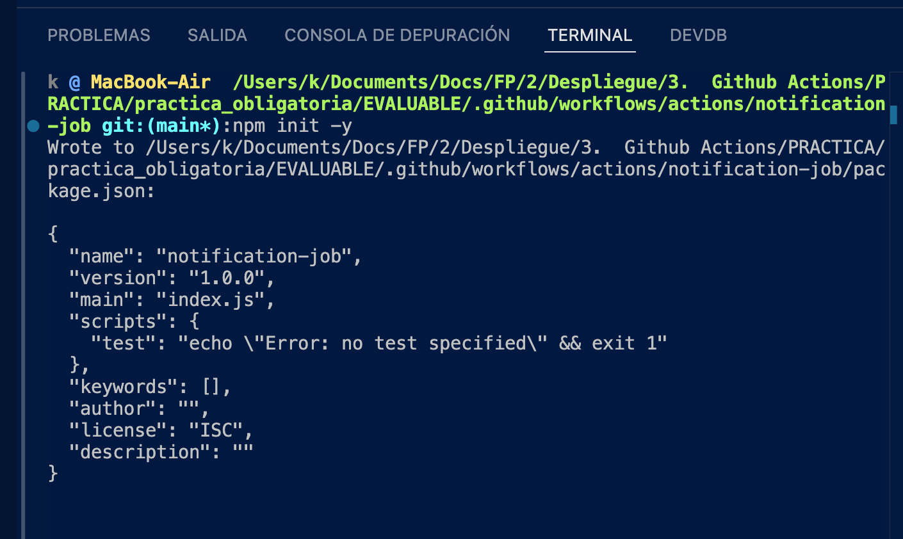

Seguidament, creem l'arxiu action.yml que consisteix en una accio personalitzada que te com a inputs obligatoris:

- Token del bot de Telegram
- Id del usuari de Telegram
- Nom del workflow
- Resultats dels cuatre jobs anteriors
- Retorna l' estat del enviament de la notificació

Finalment, executa l'arxiu que compilarem i que conte la funcionalitat (dist/index.js), en node versió 20

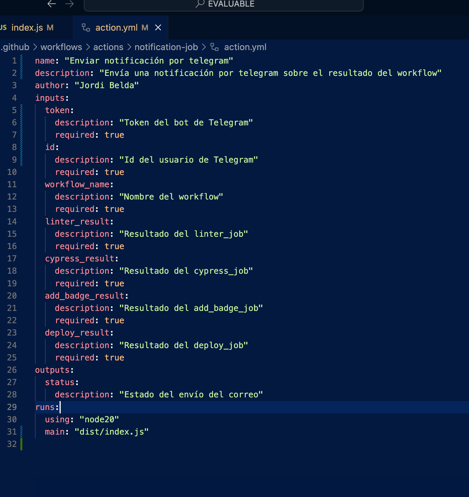

Creem l'arxiu index.js a l' arrel del projecte que será el que continga tota la lógica que durá a terme l'acció.
Es una funció en javascript que te com a arguments les set variables que hem nomenat en el punt anterior.
Crea una plantilla en el que informa de l' estat del workflow i finalment l' envía al bot de Telegram

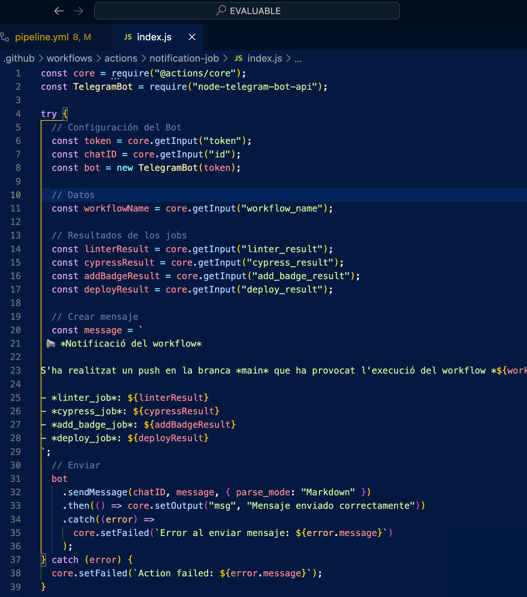

Tot seguit, instalades les dependencies (actions/core , actions/github i vercel/ncc ) necesaries per a que el script funcione degudament i pugam compilar-lo, també instalem la dependencia per a enviar el missatge al bot.
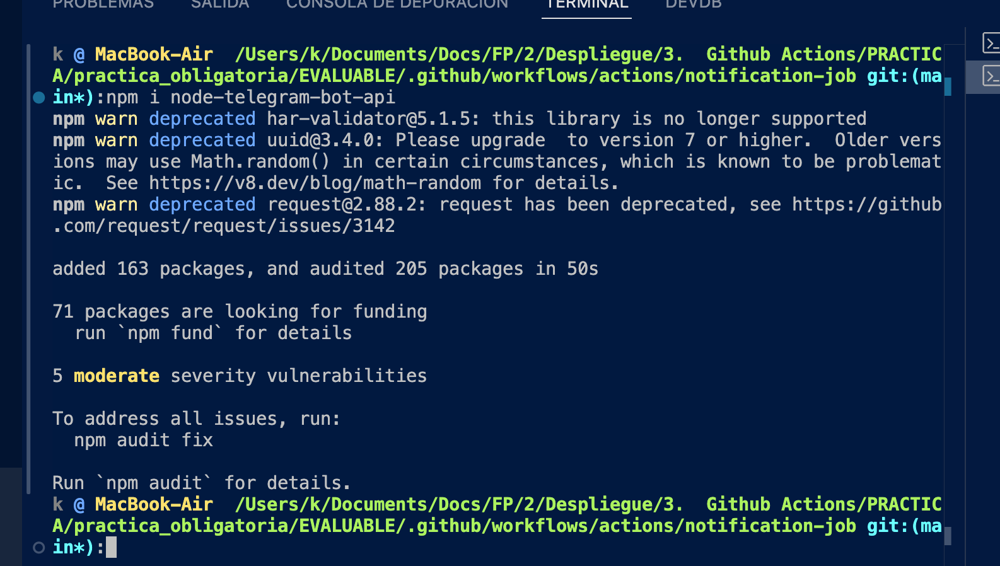

Captura del package.json de l'acció
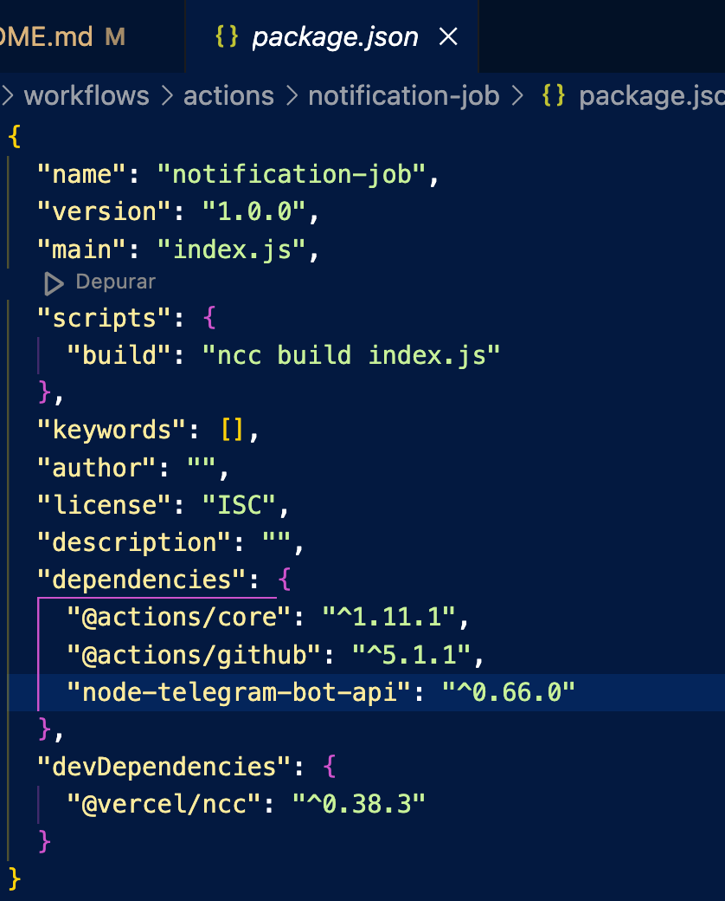

Passem al pipeline i definim un nou job que conté:

- S'executa amb l' ultima versió d'Ubuntu
- S'executa sempre
- Precisa dels cuatre jobs anteriors
- Primer pas
  - Checkout, per accedir als arxius del projecte
- Segon pas
  - Executa l'action personalitzada que acavem de crear amb les variables anteriorment descrites.

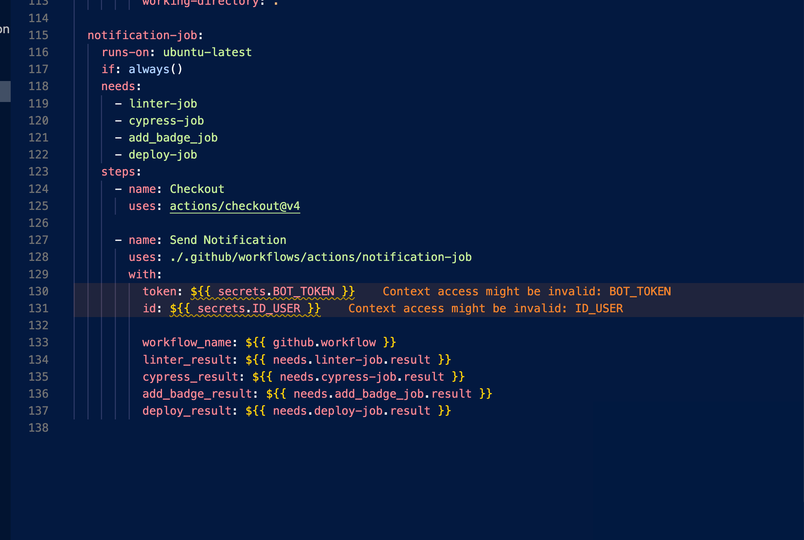

En Telegram, creem un nou bot amb Bot Father i copiem el token
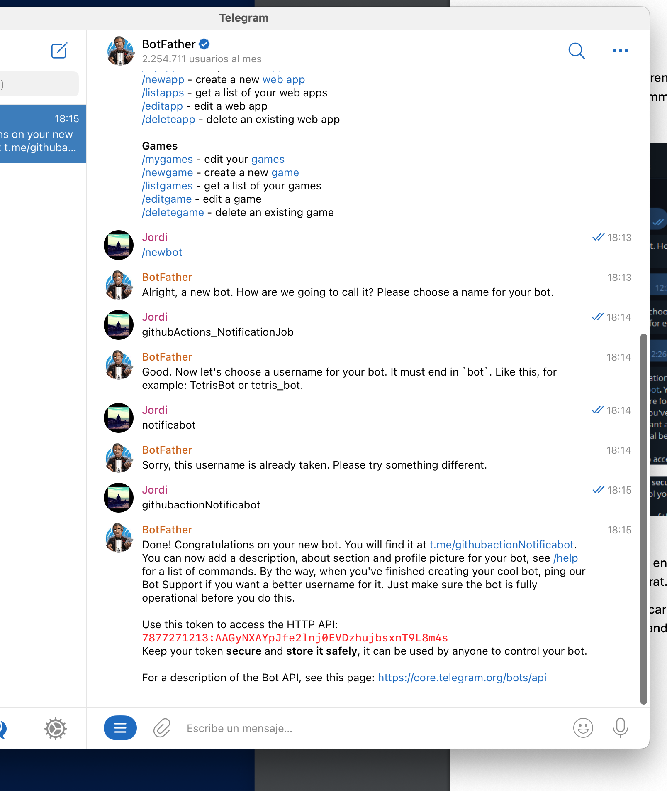

Aconseguim l' id del compte i el copiem com un token
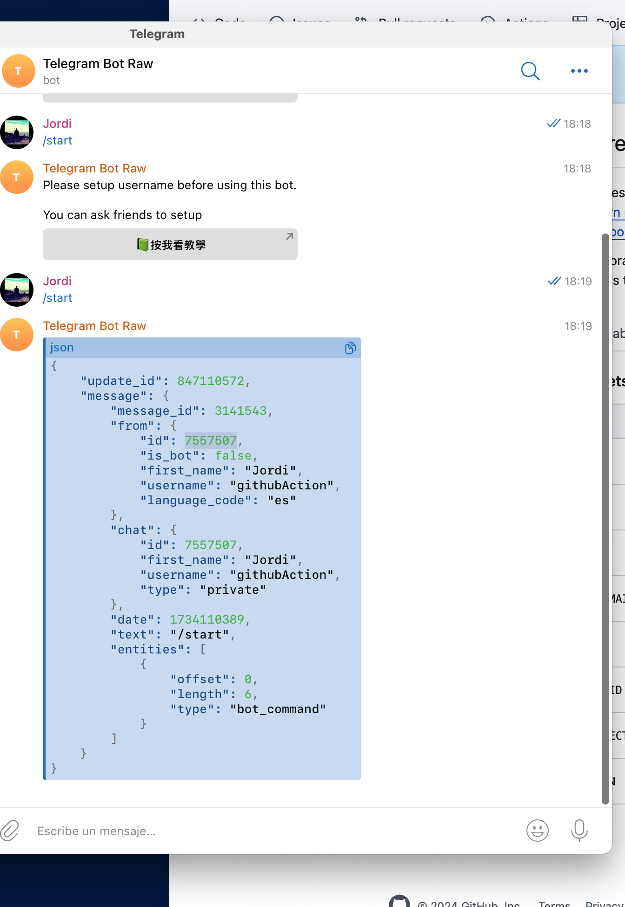

Almacenem els tokens com un secret en Actions > Repository Secrets
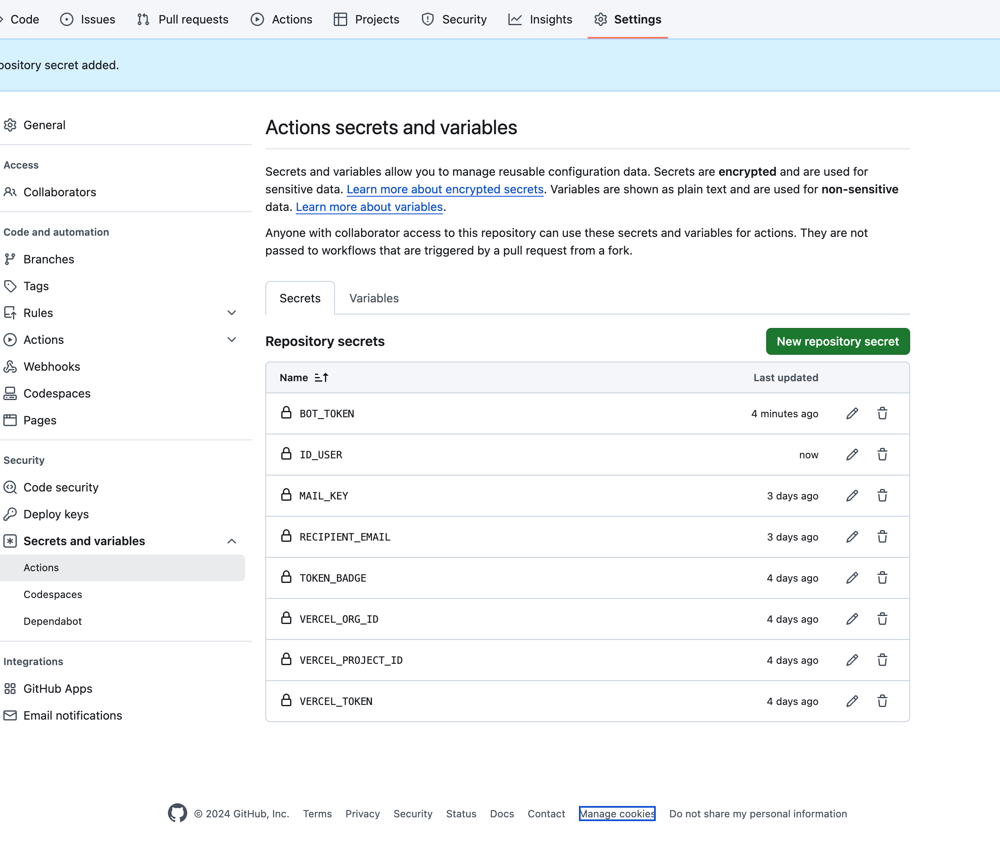

Fem un commit amb els canvis i comprovem que tot vaja com es degut.
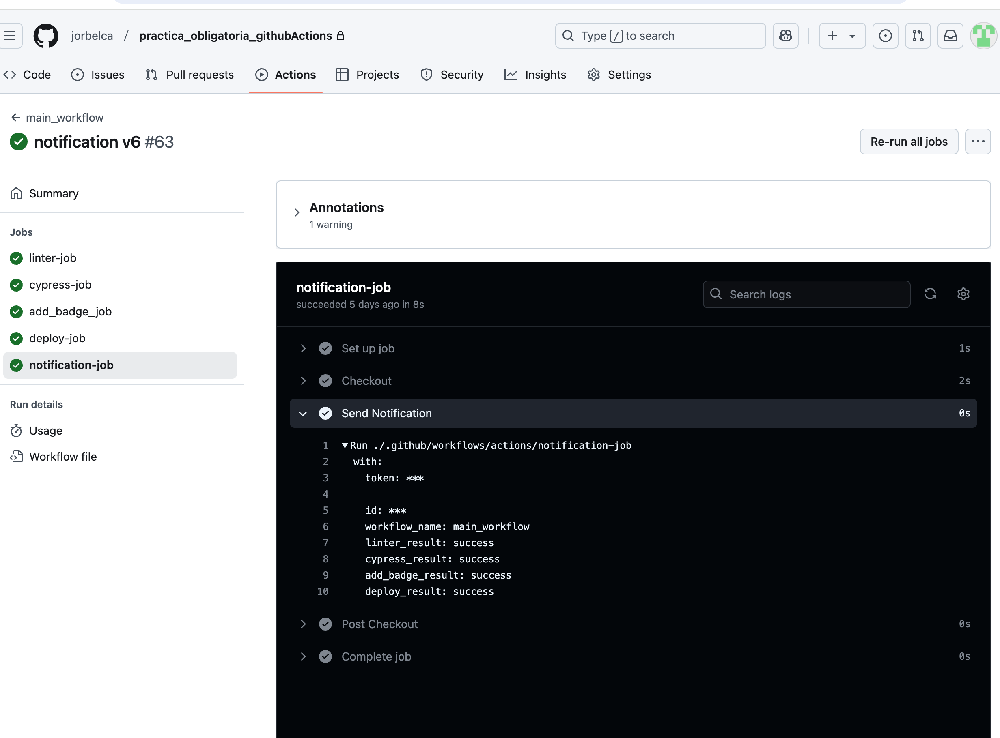

**FALLO**

Per tal de comprovar que en cas de un error en un job, s'executa degudament, forcem un error en l'execucio d'un job .
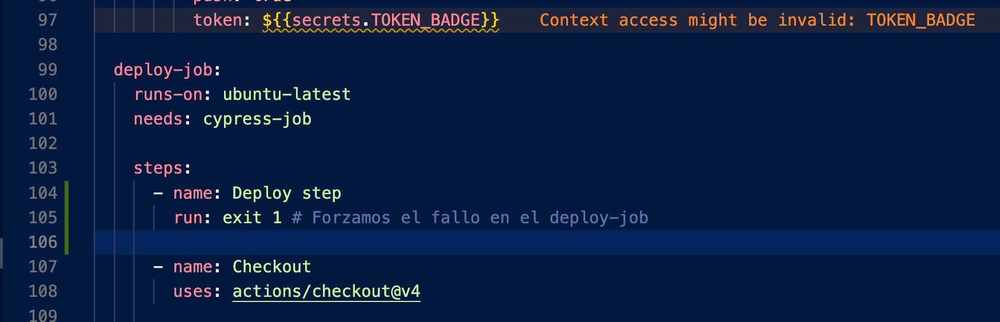

Finalment, captura amb les dos notificacions.
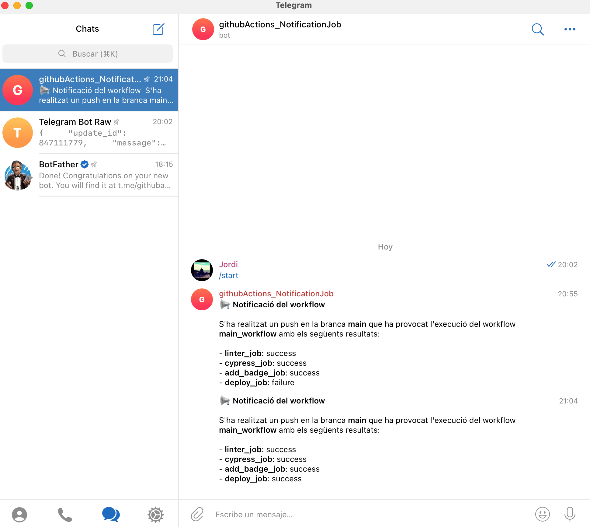

### Readme

Primer que res, creem un token desde el perfil de GitHub > Settings > Developer Settings > Personal Access Tokens > Tokens classic > Generate new token.


I el guardem com un secret en Actions > Repository Secrets


Despres, modifiquem el Readme per poder mostrar les metriques, al final del arxiu fem un apartat dedicat


Seguidament creem un arxiu pipeline.yml dins de .github/workflows, que es veu aixi:


Aquest arxiu es compon de dos jobs un per a les metriques globals del perfil i un altre per a les de llenguatges de programacio. Tambe s'executara una vegada al dia i tambe donem la opcio per poder executar les actions manualment per a ocasions com la que tenim entre mans.

Fem el commit dels canvis i comprovem que els jobs s'hagen executat correctament


Finalment, comprovem que el readme s'haja actualizat correctament


# Badge de Cypress

<!---Start place for the badge -->

[](https://www.cypress.io/)

<!---End place for the badge -->
