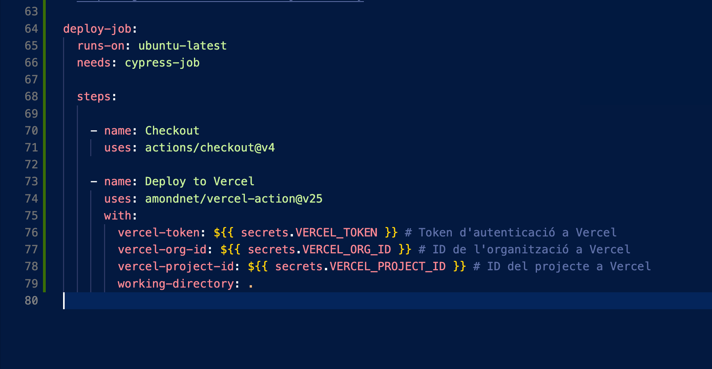
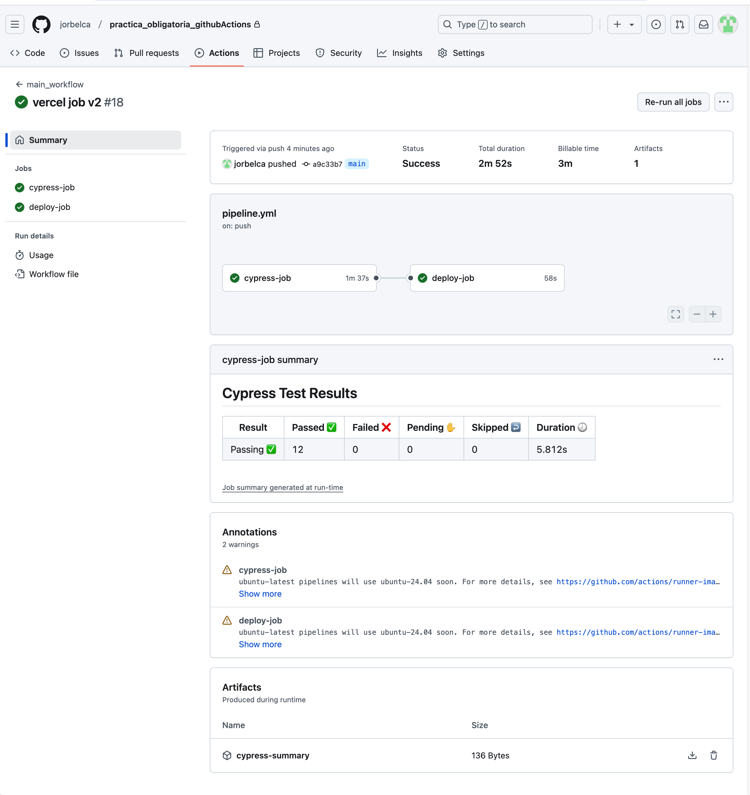
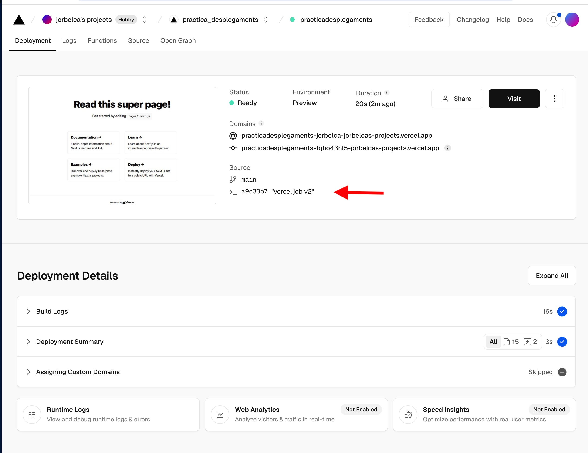

# practica_obligatoria_githubActions

Primer que res, creem un repositori propi i clonem el repo que ens dona l’ enunciat.

Instalem els moduls de node

Comprovem que el projecte s' inicia

### Linter-job

Executem npm run lint en local perque comprove la sintaxi

Corregim tots els errors

Creem la carpeta .github i dins de /workflows creem la primera action que correspon a EsLint

Fem el commit i comprovem que haja passat tots els jobs

### Cypress-job

Seguidament, executem en local cypress per comprovar que els tests s'executen correctament (corregint el bug que hi havia )

Fem el commit i comprovem que haja passat tots els jobs i que haja generat correctament l' artifact

### Badge-job

### Deploy-job

Primer que res hem de vincular el nostre projecte amb Vercel, per aixo executem en consola vercel y configurem el projecte seguint les preguntes

Generem un token desde Vercel i amb els tokens que ha generat la vinculacio del projecte els almacenem com a secrets per a les actions

Creem el deploy-job que consistirá en un checkout i l' action específica de Vercel

Fem el commit i comprovem que haja passat tots els jobs i que s'haja desplegat correctament a Vercel.

### Notification-job

Example of nextjs project using Cypress.io

<!---Start place for the badge -->

<!---End place for the badge -->
