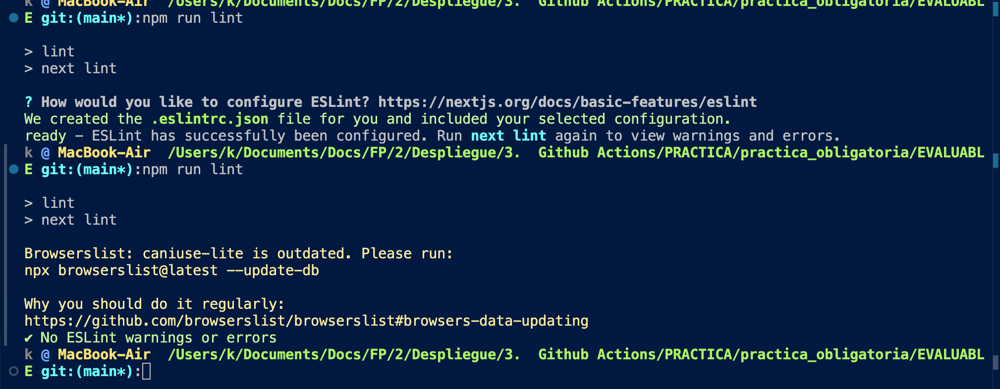
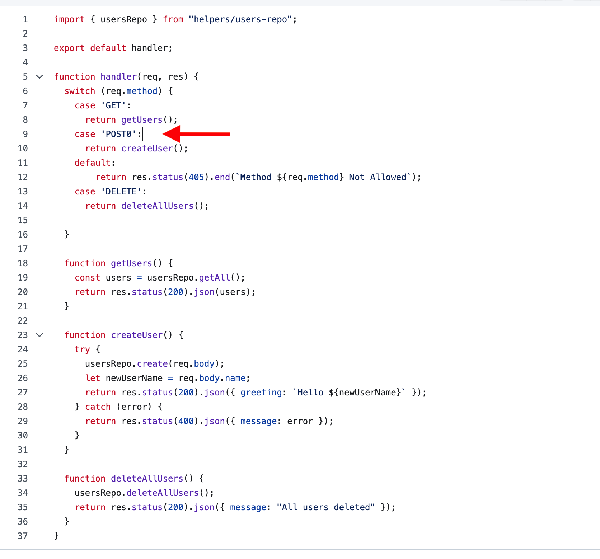

# practica_obligatoria_githubActions

Primer que res, creem un repositori propi i clonem el repo que ens dona l’ enunciat.

Instalem els moduls de node

Comprovem que el projecte s' inicia

Executem npm run lint en local perque comprove la sintaxi

Corregim tots els errors

Creem la carpeta .github i dins de /workflows creem la primera action que correspon a EsLint

Fem el commit i comprovem que haja passat tots els jobs

Seguidament, executem en local cypress per comprovar que els tests s'executen correctament (corregint el bug que hi havia )

Example of nextjs project using Cypress.io

<!---Start place for the badge -->

<!---End place for the badge -->
